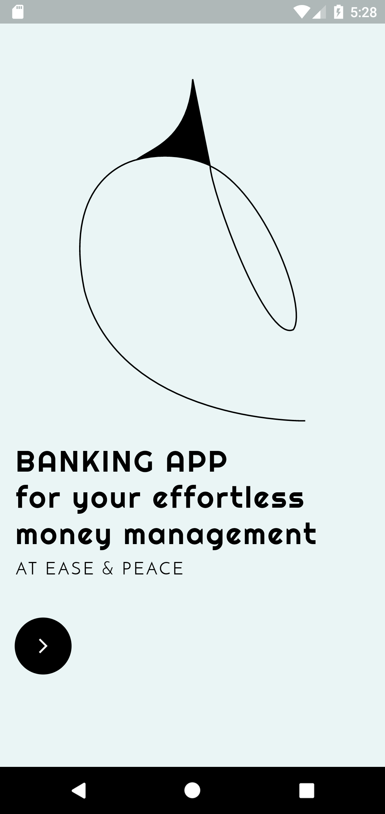
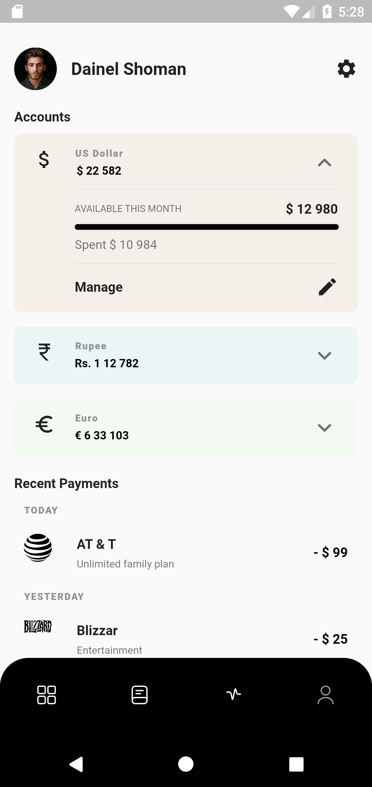
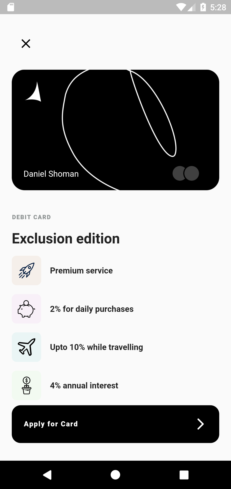

# Flutter Banking Application UI

A new Flutter project for user end minimal interface design.  

 ## Snapshots
 &nbsp;  &nbsp; 

## Features

A functional app that provides Flutter beginner with template for their mobile app projects. Features:

* Simple & seamless interface
* Attractive and clean UI
* Welcome Screen
* Bottom Navigation Bar

A few resources to get you started if this is your first Flutter project:

- [Lab: Write your first Flutter app](https://docs.flutter.dev/get-started/codelab)
- [Cookbook: Useful Flutter samples](https://docs.flutter.dev/cookbook)

For help getting started with Flutter development, view the
[online documentation](https://docs.flutter.dev/), which offers tutorials,
samples, guidance on mobile development, and a full API reference.
